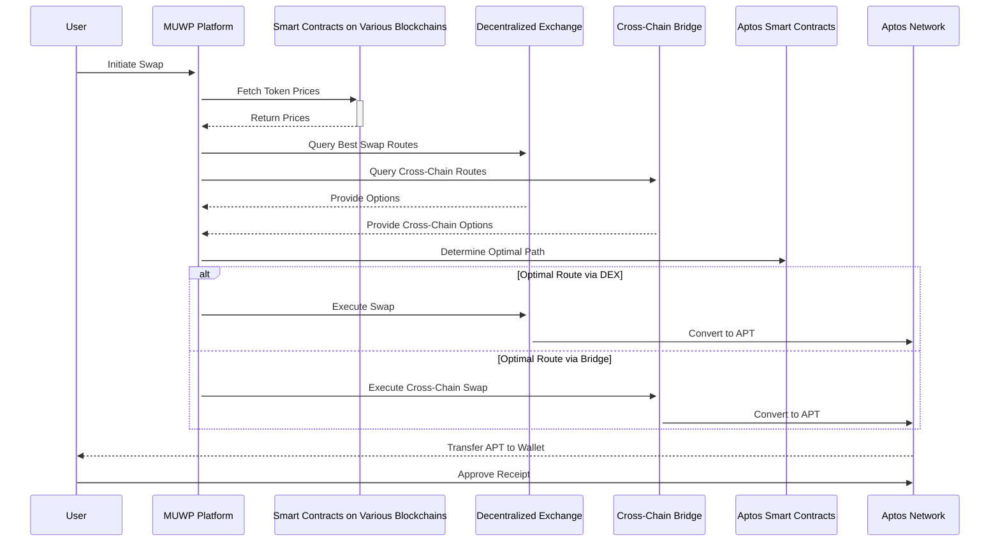

## Technical Architecture Diagram

---

## Multi-Path Swap Process with MUWP for Aptos

This sequence diagram illustrates the process a user goes through to perform a token swap using MUWP, now integrated with the Aptos Network. MUWP facilitates swaps across various blockchains by finding the most optimal route for the user's desired exchange of APT.

Here's a breakdown of each step:

**1. User Initiates Swap**
- The user interacts with the MUWP platform and initiates the swap process. This could involve specifying the desired source and destination tokens and the amount to be swapped.

**2. MUWP Fetches Token Prices**
- The MUWP platform interacts with smart contracts deployed on various blockchains relevant to the user's swap request, which provide functionality to access current token prices or exchange rates.

**3. Smart Contracts Return Prices**
- The smart contracts on various blockchains respond to MUWP's request by sending back the retrieved token prices.

**4. MUWP Queries Swap Routes**
- The MUWP platform utilizes two potential routes for the swap:
  - **Decentralized Exchanges (DEXs):** The MUWP queries DEXs to find the best exchange routes for swapping tokens directly within the user's chosen blockchain.
  - **Cross-Chain Bridges:** The MUWP queries cross-chain bridges to explore the possibility of swapping tokens across different blockchains.

**5. DEX and Bridge Respond**
- The DEXs and bridges provide the MUWP with details about the available swap options and their associated rates, potentially involving multiple intermediate tokens before reaching the desired destination token APT.

**6. MUWP Determines Optimal Path**
- The MUWP platform analyzes the information received from various sources, including token prices from smart contracts, swap options and rates from DEXs, and cross-chain swap options and fees from bridges.

**7. Execute Swap Based on Optimal Route**
- Depending on the chosen path, the MUWP interacts with the selected service:
  - **DEX:** Executes the swap through the chosen DEX, potentially involving multiple token conversions. 
  - **Bridge:** Executes the cross-chain swap through the chosen bridge, which involves wrapping, transferring, and unwrapping tokens.

**8. Convert to APT (Aptos Network)**
- Regardless of the chosen swap route, the final step involves converting the obtained tokens to APT for delivery to the user's wallet.

**9. Transfer APT to User's Wallet**
- Finally, the Aptos Network initiates the transfer of the swapped APT tokens to the user's designated wallet address.

**10. User Approves Receipt**
- The operation completes once the receiver approves the transaction, ensuring the final confirmation and acceptance of the transfer.

**This sequence diagram showcases how the MUWP smart protocol leverages various blockchain services to find the most efficient and cost-effective route for users to swap APT across different blockchains.**
